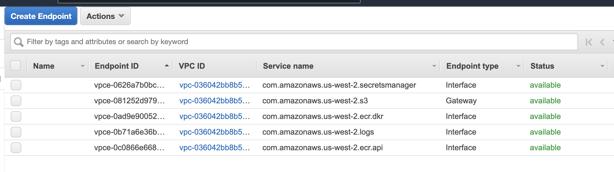

# AWS Deployment

## Basics
You can set up multiple bots, each looking at its own `Witch`/`Flash` deployment, with its own arguments.
Each instance's configuration is represented by a separate directory in .config. A sample configuration is provided.

The bot is deployed as a task in AWS Fargate: it's a simple service that runs tasks packaged as docker containers.

## Setting things up
`aws` directory contains 4 scripts that take you through deployment. Why 4 **separate** steps? Sometimes (rarely!) you need to make changes to things that are already deployed, and AWS APIs are not idempotent -> you need to manually re-run a subset of commands.

Before starting, make sure to export these environment variables:

* `$REGION` - AWS region you're deploying to
* `$AWSACCOUNT` - your AWS account ID
* `$INSTANCE` - instance name you're setting up. The deployment scripts will search for `.config/$INSTANCE` configuration directory

`$INSTANCE` can only contain alphanumerics and underscore/dashes, so be careful here.

### Step 0: setting up AWS cluster
```bash
cd aws
./00.deploy_cluster.sh
```
Create the ECS cluster that Fargate tasks will run on. This is truly a one-time step that doesn't need to be ever redone


### Step 0.1: create VPC endpoints
There are 2 types of permissions that need to be granted that needs to align: AWS **permissions** and firewall rules. Even if you allow bot to access S3, it won't be able to physically do this unless a firewall rule is created.

To create the firewall rules, we create endpoints in the VPC that hosts our task, one for each AWS service our bot needs access to.
Go to [VPC page](https://us-west-2.console.aws.amazon.com/vpc/home?), "Endpoints", and create endpoints for S3, Secrets manager, ECR (Docker container storage and API), CloudWatch:



### Step 1: create security roles
```bash
./01.deploy_roles.sh
```
Create 2 security roles: one for **launching** the task (needs permissions to pull the docker container, access S3 for storage, etc) and one that the launched task will have (nothing)

### Step 2: deploy secrets
```bash
./02.deploy_secrets.sh
```
This is important step, it fully defines your bot configuration. You define `Witch`/`Flash` addresses here, your instance name, wallet address, etc.

Takes `.config/$INSTANCE` files and uploads them as 3 separate secrets: `config.json`, `pk` (wallet private key), `args` (command line argument passed to the bot).

### Step 3: build and deploy
```bash
./03.deploy.sh
```

Build the Docker image (make sure you have the docker daemon up and running), create task definition (tells Fargate that you want to run a task with the image just built and pass secrets from step 2 to it)

### Step 4: manually launch the task
This is hard (not impossible) to automate, so this is manual at this point.

Go to `ECS` console (something like https://us-west-2.console.aws.amazon.com/ecs/home) -> `Task definitions` -> pick the task you just defined -> `Actions` -> `Run task`. Change only these:
 * Launch type: `Fargate`
 * Cluster VPC: pick the only one available
 * Subnets: pick the 1st one
 * Security groups: Edit -> Select existing -> pick `default`
 * `Run task`!

The new task instance appears in the cluster. It takes about a minute to set up, then the task should become `RUNNING`

### Step 5: adding the new instance to CloudWatch dashboard
Open the dashboard (https://us-west-2.console.aws.amazon.com/cloudwatch/home?region=us-west-2#dashboards:name=yield), edit each graph to add the counters from the new instance there.
Don't forget to copy the new Source for each graph to the monitoring page. Use `dashboard_encode.py` for this: launch it, copy/paste the graph source to it.

